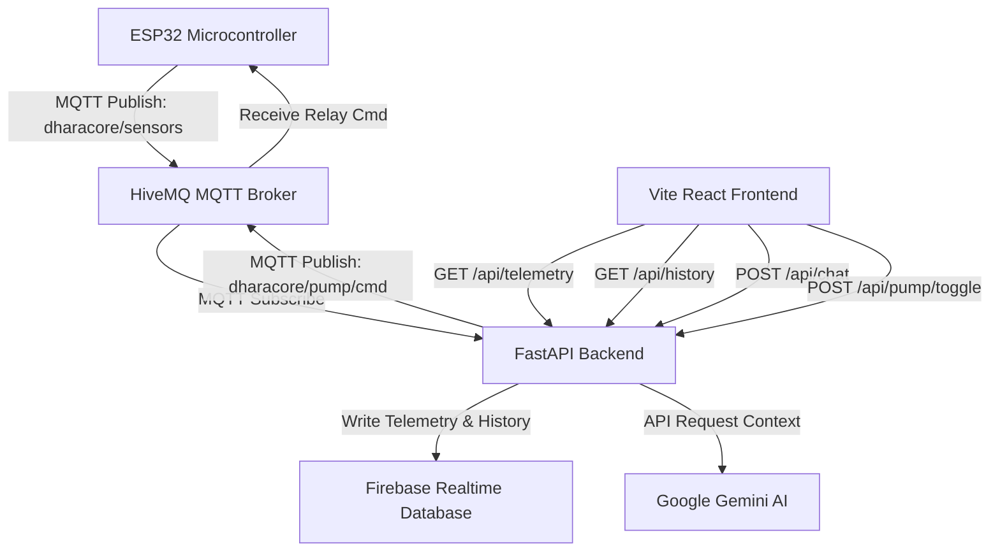

# Neuro VP Dhara Core 🌾
> **AI-Driven Smart Agricultural & Automatic Irrigation IoT Dashboard**

**Neuro VP Dhara Core** is a production-ready, high-fidelity IoT dashboard and edge-computing smart irrigation system designed for small-scale precision farming in Hoskote. By combining physical ESP32 microcontrollers, real-time MQTT messaging, Firebase persistence, and Google Gemini AI, it empowers farmers with automated water management, crop risk analytics, and an intelligent chat advisor.

---

## 🚀 Key Features

* **💎 Premium Glassmorphic Dashboard**: A dark-themed, ultra-premium responsive layout with visual status indicators, gauges, and interactive charts.
* **📈 Real-Time Sensor Trends**: 24-hour Recharts line chart illustrating ambient temperature, relative humidity, and capacitive soil moisture dynamics.
* **🤖 AI Shakti Chat Assistant**: A localized, context-aware AI chatbot powered by Google Gemini (`gemini-1.5-flash`) that accepts real-time sensor parameters to generate agronomic recommendations.
* **⚡ Smart Water Pump Controls**: Manual and automated relay override switch, updating state over Firebase and sending immediate commands to the ESP32 via MQTT.
* **🔔 Dynamic Edge Alerts**: Live notifications (critical dry soil warnings, heat stress notifications, and weather status updates) compiled dynamically based on sensor thresholds.
* **🛡️ Failsafe Architecture**: Dual database mode (Firebase RTDB + in-memory fallback) and AI backup logic ensuring the system never crashes even if external services go offline.

---

## 📦 Tech Stack

### Frontend
* **Core**: React 18, Vite, Tailwind CSS (v3)
* **Charts & Icons**: Recharts (dynamic responsive containers), Lucide React
* **Typography**: Outfit, Inter (Google Fonts)

### Backend
* **Web Framework**: FastAPI (Uvicorn ASGI server)
* **IoT Protocols**: MQTT (Paho MQTT Client, TLS secure sockets)
* **Cloud Persistence**: Firebase Admin SDK (Realtime Database integration)
* **AI Engine**: Google GenAI SDK (Gemini Pro/Flash models)

### Hardware / Edge
* **Board**: ESP32 Microcontroller
* **Sensors**: Capacitive Soil Moisture Sensor, DHT22 Temperature/Humidity Sensor
* **Actuators**: 5V Relay Module (Water Pump Control)
* **Local Output**: SSD1306 128x64 OLED display

---

## 📐 System Architecture



---

## 🛠️ Installation & Setup

### 1. Prerequisites
Ensure you have the following installed:
* [Node.js](https://nodejs.org/) (v18+)
* [Python](https://www.python.org/) (v3.9+)
* [Arduino IDE](https://www.arduino.cc/en/software) (for uploading hardware code)

### 2. Clone and Configure
1. Create a `.env` file in the root directory:
   ```env
   FIREBASE_CRED_PATH=serviceAccountKey.json
   FIREBASE_DB_URL=https://your-project-rtdb.firebaseio.com
   GEMINI_API_KEY=AIzaSy...
   HIVEMQ_HOST=your-cluster.hivemq.cloud
   HIVEMQ_USER=username
   HIVEMQ_PASS=password
   ```
2. If using Firebase, place your downloaded `serviceAccountKey.json` inside the root workspace folder.

### 3. Run Backend (FastAPI + Embedded Serve)
1. Install Python requirements:
   ```bash
   pip install -r requirements.txt
   ```
2. Start the integrated server:
   ```bash
   python main.py
   ```
   *The server will run on `http://localhost:8000` and automatically serve both the API and the compiled React frontend.*

### 4. Run Frontend (Development Mode)
If you wish to make live code modifications:
1. Navigate to the `frontend` folder:
   ```bash
   cd frontend
   ```
2. Install dependencies & launch:
   ```bash
   npm install
   npm run dev
   ```
   *Access the hot-reloading dev environment at `http://localhost:5173/`.*

### 5. Upload Hardware Code
1. Open `DharaCore.ino` in Arduino IDE.
2. Replace `"YOUR_WIFI_SSID"`, `"YOUR_WIFI_PASSWORD"`, and your MQTT credentials with your local details.
3. Flash the code to your ESP32 board using a USB datacable.

---

## 👨‍💻 Developer
This project is designed and developed by **Ayush Kumar** ([@AyushKumar5555-png](https://github.com/AyushKumar5555-png)).

---

## 📝 License
This project is open-source under the MIT License.
